# submission
# CST-339 Activity 2 Report

**Date:** February 2, 2025
**Name:** Lauren Hutchens

## Introduction

This report details the development of a Spring MVC web application, encompassing model creation, view design, controller implementation, form handling with data validation, and the integration of Thymeleaf layouts. The project is structured according to the Model-View-Controller (MVC) architectural pattern, utilizing Spring Boot for rapid development and Thymeleaf for dynamic view rendering.  This report will walk through each part of the activity, detailing the code written, the diagrams associated with the code, and the results observed.

## Research Questions
1.
How does Spring MVC support the MVC design pattern? Draw a diagram that supports the answer tothis question.

Spring MVC is a framework that implements the Model-View-Controller (MVC) design pattern. It uses the DispatcherServlet as the central controller, handling incoming requests. This servlet then delegates to other components like controllers, which interact with the model. Views are generated based on the model data and returned to the user. This separation of concerns makes the application more modular and maintainable.

Research and identify 2 MVC Frameworks other than Spring MVC. What are the frameworks andhow do they differ from Spring MVC?

2.Besides Spring MVC, there are other MVC frameworks out there. Two that come to mind are Ruby on Rails and Apache Struts. Ruby on Rails, often just called Rails, is known for its "convention over configuration" philosophy, making development fast and easy for common tasks, which is different from Spring's more configuration-heavy approach. Rails is heavily opinionated, while Spring gives you more flexibility. Then you have Apache Struts, which is another Java-based framework. Struts uses interceptors to handle requests, which is a different approach than Spring's servlet-based dispatching. Struts, in my experience, can be a bit more complex to set up than Spring, and it's older, so Spring is generally more widely used now. Both frameworks, though, like Spring MVC, aim to separate concerns and make web development more structured.

## part one
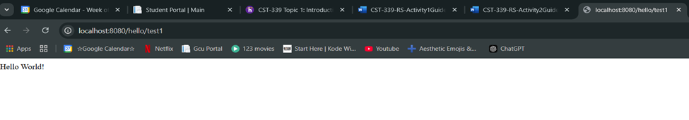
#### The browser displays a simple webpage with the heading "Hello World!".  The URL in the address bar indicates it's a locally hosted page: "localhost:8080/hello/test1". 
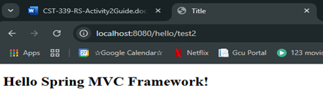
#### The browser displays a webpage with the heading "Hello Spring MVC Framework!". The URL in the address bar reads "localhost:8080/hello/test2", indicating it's a locally hosted page likely generated by a Spring MVC application.
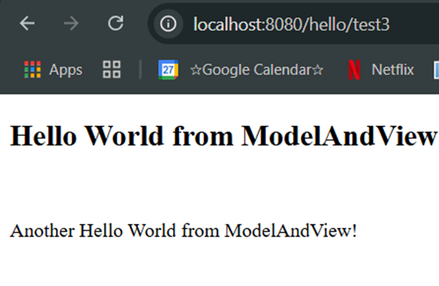
#### With the title/heading "Hello World from ModelAndView" and the subheading "Another Hello World from ModelAndView!". The URL in the address bar is "localhost:8080/hello/test3".
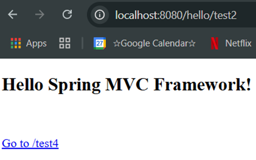
#### The browser displays a webpage with the heading "Hello Spring MVC Framework!" and a link below it that says "Go to /test4".  The URL in the address bar shows "localhost:8080/hello/test2", indicating a locally hosted page.

## test responses with proper messages and links to test2, test3, and test4.

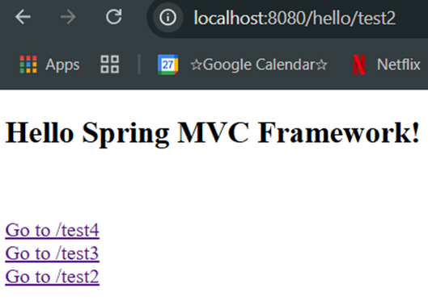
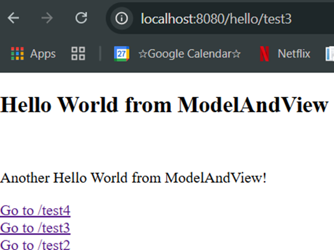
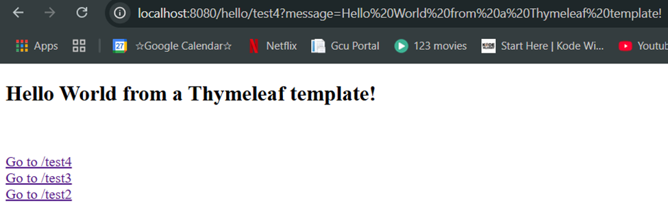
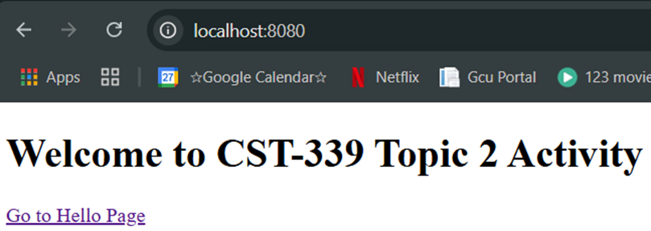

## part two
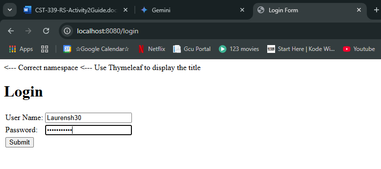
#### The browser displays a simple login form with fields for username and password, along with a "Submit" button, on a page titled "Login Form" and hosted locally.
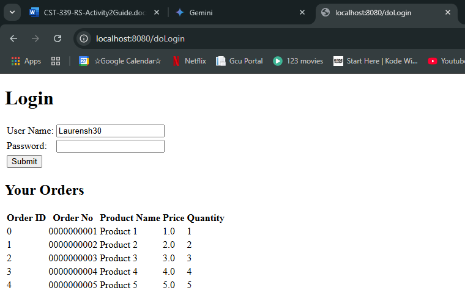
#### The browser displays a webpage with a login form and a section below showing "Your Orders" with a table of order details, all hosted locally.
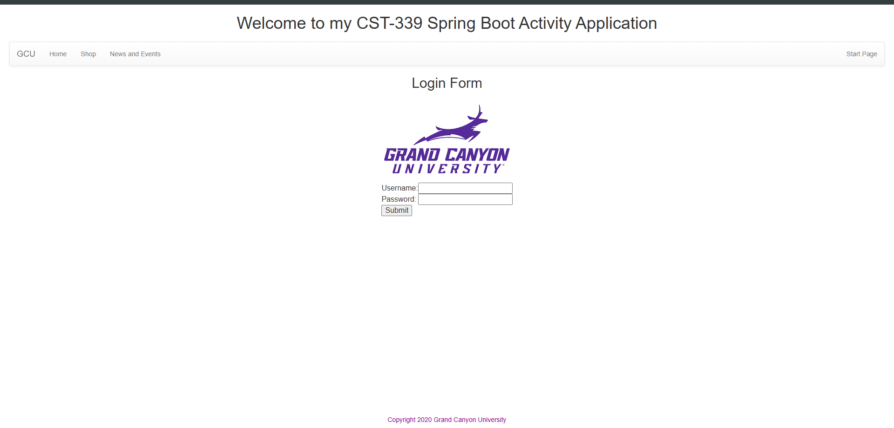
#### The browser displays a webpage with a Grand Canyon University-themed login form, including the logo and fields for username and password, within a larger page titled "Welcome to my CST-339 Spring Boot Activity Application".
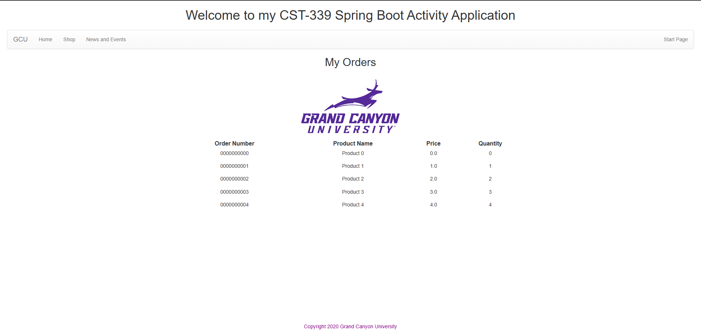
#### The browser displays a webpage titled "Welcome to my CST-339 Spring Boot Activity Application" with a Grand Canyon University logo and a section titled "My Orders" showing a list of orders with details.
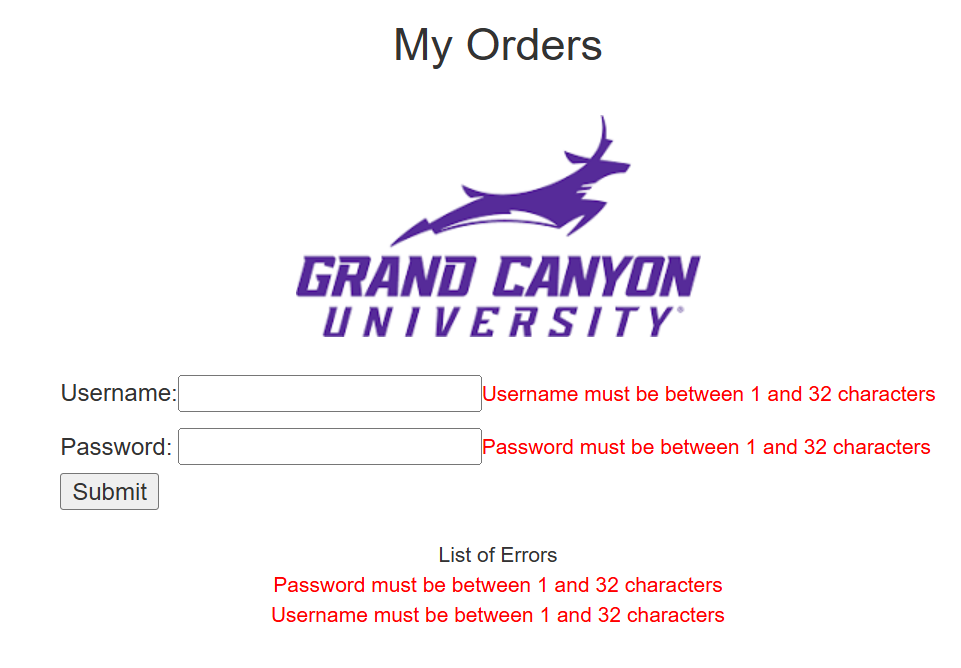
#### The browser displays a Grand Canyon University-themed page with a "My Orders" heading, a login form with username and password fields, and a list of errors indicating character limits for both fields.

## part three

#### The browser displays a Grand Canyon University-themed login page with a form for username and password, within a webpage titled "Welcome to my CST-339 Spring Boot Activity Application".

#### The browser displays a webpage titled "Welcome to my CST-339 Spring Boot Activity Application" with a Grand Canyon University logo and a table displaying a list of orders.
